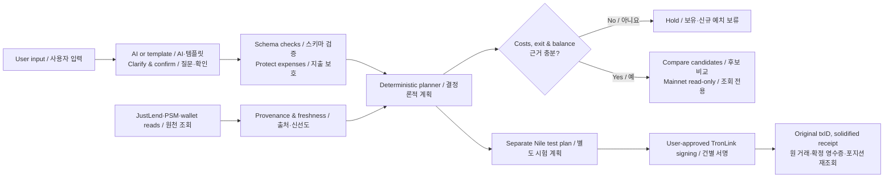

# TROMM | Cash-flow-aware TRON Asset Planning · 지출일을 지키는 TRON 자산 계획

TROMM stands for **TRON Money Management**. 예정 지출을 지키는 TRON 자산 계획 시연 프로젝트입니다.

> **Protect upcoming expenses first. Check round-trip costs and withdrawal feasibility before considering yield. Hold when the evidence is insufficient.**<br/>
> **예정 지출을 먼저 보호하고, 왕복 비용과 회수 가능성을 검토한 뒤, 근거가 부족하면 거래를 보류합니다.**

This repository contains the GWDC 2026 Challenge B plans and the [LeeMir demo app](TeamBaek/LeeMir/). The design aims to compare JustLend, a USDD route, and holding cash under the same budget and time horizon. **The verified on-chain round trip is one user-approved JustLend jTRX deposit and redemption on Nile testnet.** Two executable Mainnet plans and a USDD round trip have not been verified.

이 저장소에는 팀 기획 문서와 LeeMir 시연 앱이 있습니다. Mainnet의 계획 비교와 Nile의 시험 거래는 서로 다른 체인·자산의 근거로 관리합니다.

## Overview | 한눈에 보기

| Focus / 항목 | What it means / 핵심 |
| --- | --- |
| Problem / 문제 | Displayed APY alone does not account for scheduled spending, exit timing, liquidity, or entry and redemption costs. 예정 지출과 왕복 비용을 함께 봅니다. |
| User / 대상 | TRON asset holders with upcoming expenses. 보유액·지출일·예비액·위험 수용 여부를 확인합니다. |
| Decision / 판단 | Compare eligible candidates; return **hold / insufficient data / pause new deposits** when net outcome or exit evidence is missing. 근거가 없으면 보유합니다. |
| AI boundary / AI 역할 | AI helps extract and clarify requirements. Schemas and deterministic code calculate amounts and gate execution. 모델이 금리·계약을 임의로 결정하지 않습니다. |
| Implementation / 구현 | [LeeMir app](TeamBaek/LeeMir/): React UI, local API, planning rules, and a user-approved Nile test path. |
| Evidence / 근거 | [Implementation status](TeamBaek/LeeMir/docs/IMPLEMENTATION_STATUS.md) and [Nile transaction evidence](TeamBaek/LeeMir/docs/NILE_A_EVIDENCE.md) separate code, tests, external reads, and on-chain results. |

### One-line pitch | 발표용 한 문장

**“Before showing a yield, check whether the user can still pay on the due date.”**

**“수익률을 보여주기 전에, 지출일에 쓸 돈을 제때 확보할 수 있는지 확인합니다.”**

## User scenario & decision math | 문제와 계산 예시

**Illustrative scenario / 가상 시나리오:** 1,000 USDT held − 200 USDT scheduled expense = **800 USDT maximum under the full-period protection rule**. The same 200 USDT stays protected when its due date moves from day 7 to day 45; the date changes the withdrawal deadline and time-window assessment, not this cap.

가상의 사용자가 **1,000 USDT**를 보유하고 **7일 뒤 200 USDT**를 지출한다면, 전 기간 보호 방식의 운용 상한은 `1,000 − 200 = 800 USDT`입니다. 예비액이 있으면 그만큼 더 제외합니다. 현재 계산 코드는 **운용 종료일 뒤에 예정된 지출도 우선 보호**하므로, 지출일을 45일 뒤로 옮겨도 같은 200 USDT를 제외한 상한은 800 USDT입니다. 날짜가 바뀌면 달라지는 것은 주로 **필요한 회수 기한과 해당 구간의 판단**입니다. [지출 보호 계산](TeamBaek/LeeMir/shared/planning.ts), [수정된 시연 사례](TeamBaek/LeeMir/docs/PROJECT_PLAN.md)

At an **assumed 5% APY** for 30 days, 800 USDT yields about **3.21 USDT before costs**: `800 × ((1 + 0.05)^(30/365) − 1)`. This is a synthetic illustration, **not a live rate or realized profit**. [Demo calculation](TeamBaek/LeeMir/shared/demo-estimate.ts)

승인·예치·환매·전환 비용과 출구 유동성이 확인되지 않으면 순이익과 거래 권고를 확정하지 않습니다. 5%는 현재 상품 금리가 아닙니다.

실지갑을 이용한 판단에서는 **`운용 상한 = min(확인된 보유액, 사용자 진술액) − 예정 지출 합계 − 예비액`**으로 재원을 제한합니다. 후보별 예상 순익은 **기본 이자 + 조건이 확인된 보상 − 진입·회수의 전체 비용**으로 비교합니다. 비용을 같은 자산으로 환산할 근거, 계약 상태, 출구 유동성 또는 회수 기한이 빠지면 순익을 숫자로 확정하지 않습니다. [실잔액 상한](TeamBaek/LeeMir/server/agent/assessment.ts), [적격성 검사](TeamBaek/LeeMir/shared/eligibility.ts)

## Differentiation vs existing services | 기존 서비스와의 차별점

This table compares **documented product capabilities** with TROMM's decision focus and verified scope. It does not claim that other services lack a feature or that TROMM is the first to offer AI analysis or cost previews.

각 서비스의 공식 문서에서 확인한 기능과 TROMM의 판단 설계·검증 범위를 비교했습니다.

| Service / 비교 대상 | Documented capabilities / 공식 기능 | TROMM focus & evidence / 차별점과 검증 상태 |
| --- | --- | --- |
| [JustLend MCP](https://docs.justlend.org/ai_support/mcp_server/) | Market and position analysis, supply/redeem actions, cost estimates, AI guidance, and user confirmation. | **Protect multiple expenses first**, then require round-trip cost and exit evidence. Nile jTRX has one verified user-approved round trip; Mainnet execution is unverified. |
| [USDD PSM & MCP](https://docs.usdd.io/ai-support/mcp-server) · [PSM guide](https://docs.usdd.io/user-guide/psm-peg-stability-module) | Two-way PSM swaps, fee/capacity reads, and USDD product tools. | Treat PSM as an **entry/exit conversion route, not the yield source**; assess the subsequent JustLend jUSDD path and full costs. Mainnet capacity reads are partial evidence; round-trip profit and swaps are unverified. |
| [DeFi Saver](https://help.defisaver.com/general/what-is-defi-saver) · [Automation](https://defisaver.com/features/automation) **(adjacent DeFi example; not a TRON service)** | Position management and condition-based automation. | Focus on scheduled payments and funds available by each due date. Browser-closed monitoring and unattended trading are not implemented. |

**Core differentiator: protect expenses → verify net outcome and exit → hold when evidence is insufficient.** 조건이 미확인인 후보를 높은 APY만으로 실행 가능하다고 표시하지 않습니다. [Planning rules](TeamBaek/LeeMir/shared/planning.ts), [agent decision](TeamBaek/LeeMir/shared/agent-decision.ts)

## Technical architecture | 기술 설계

AI extracts and clarifies; source-aware, deterministic code calculates and gates decisions. The Nile approval path is a separate testnet path, not execution of a Mainnet plan. AI는 조건 정리를 돕고, 검증 코드는 자금·근거·거래 가능성을 판단합니다.



| 구성 | 구현 방식과 경계 |
| --- | --- |
| 요구 분석 | NIM `openai/gpt-oss-20b`를 통한 조건 추출을 확인했습니다. 키가 없거나 호출이 실패하면 템플릿 분석을 사용합니다. 모델 출력은 검증·사용자 확인을 거치며 계약 주소나 수익률을 모델의 말만으로 채택하지 않습니다. |
| 시장·체인 데이터 | JustLend REST·TRON RPC와 PSM 계약 읽기를 연결합니다. 데이터마다 `live` / `snapshot` / `synthetic`, 체인, 출처 URL, 조회 시각과 제공 시 원천 갱신 시각을 구분합니다. 공식 MCP는 선택적 연결이며 연결 여부를 별도로 진단합니다. |
| 계획·경제성 | `decimal.js`와 온체인 정수 단위로 금액을 계산합니다. 지출·예비액과 실잔액 상한, 날짜별 구간, 기본 이자와 별도 보상, 공동 승인 비용, 진입·회수 비용, 유동성·회수 지연을 검사합니다. 미확인 비용은 0으로 간주하지 않습니다. |
| 판단·감시 | 조건 충족 여부를 코드로 판정합니다. 선택 계획은 화면 진입·5분 간격·탭 복귀 때 재조회하여 유지 / 신규 예치 보류 / 재검토를 제안합니다. 과거·가상 재생은 거래 권한이 없습니다. |
| 거래 안전성 | Nile 승인형 시험에서는 미리보기 재검증 → 지갑 소유 메시지 서명 → 서버 의도 예약 → 별도의 TronLink 거래 서명 → 방송 전 원 txID·서명 원문 접수 → 확정 영수증·포지션 재조회 순서입니다. 로컬 서버의 암호화된 SQLite 원장으로 미해결 거래를 추적합니다. |

### Protocol scope | 프로토콜별 적용 범위

| 기술 | 이 프로젝트에서 사용하는 방식 | 남은 검증 |
| --- | --- | --- |
| JustLend V1 | Mainnet jUSDT·jUSDD 시장을 읽고, Nile jTRX의 `mint()`·`redeem(uint256)`를 시험했습니다. 원자산과 jToken의 단위를 각각 확인합니다. | Mainnet 지갑별 미래 환매 수수료·회수 가능성과 왕복 순익 |
| USDD PSM | USDT↔USDD 전환의 계약·토큰·수수료·양방향 용량을 확인합니다. PSM은 전환 수단이고 jUSDD 예치 이자와 구분합니다. | 실제 출력 토큰·거래 비용·USDD 가격 위험을 포함한 완전한 진입·출구 경로 |
| SunSwap·Stake 2.0 | 자금 조달·대안 경로의 풀 잔고, 해제 대기 등 읽기 자료를 제공합니다. | 검증된 풀 수수료, 미래 출구 가격·보상·비용. 현재 순익·추천으로 승격하지 않습니다. |
| TronLink·TRON RPC | 사용자가 지갑을 직접 승인·서명하고, 앱은 체인·계정·계약·수수료 한도와 원 거래 영수증을 확인합니다. | Mainnet 실제 거래와 무인 실행은 별도 게이트가 필요합니다. |
| 공식 MCP·GasFree | MCP는 선택적 **읽기 보조**로 연결 상태를 진단합니다. GasFree는 현재 공통 실행 경로에 포함하지 않았습니다. | 토큰 전송 지원을 JustLend의 임의 계약 호출 대납으로 확장해 주장하지 않습니다. |

Mainnet USDT·USDD **조회·가정 계산**과 Nile TRX·jTRX **시험 거래**는 체인과 자산이 다릅니다. 한쪽 금리나 거래 영수증을 다른 쪽의 실행·수익 증거로 합치지 않습니다.

## Evidence & current scope | 현재 검증된 것과 남은 것

**Verified on Nile does not mean verified on Mainnet.** Code tests, external reads, signed transactions, solidified receipts, and position observations are separate evidence levels. Nile 실증을 Mainnet 수익·거래 근거로 사용하지 않습니다.

| Path / 경로 | Evidence / 확인한 근거 | Status / 현재 판정 |
| --- | --- | --- |
| Requirements & planning / 요구 분석 | One observed NIM extraction, browser demo, and calculation/gate tests. | **Implemented, partly observed / 부분 실증.** Declared holdings are not wallet balances. |
| Mainnet jUSDT | Market/rate-model reads, some wallet/position reads, amount-specific read-only code. | **Read-only / 조회 전용.** Two real-wallet amount quotes and validated future redemption costs are missing; net profit and new deposits remain on hold. |
| Mainnet USDD PSM → jUSDD | Contract/token links, two-way capacity reads, candidate calculations. | **Partial reads / 부분 조회.** Full entry/exit costs and swaps are unverified. |
| Nile JustLend jTRX | User-approved `1 TRX → 89.46435499 jTRX → 1 TRX`; two original txIDs, two solidified `SUCCESS` receipts, same position `0 → 89.46435499 → 0 jTRX`. | **Technical round trip verified / 승인형 왕복 실증.** Fees totaled **15.3463 test TRX**; net cash flow was **−15.3463 test TRX**, not profit. [Transaction evidence](TeamBaek/LeeMir/docs/NILE_A_EVIDENCE.md) |
| Nile PSM USDD↔USDT | Contract, balance, fee and capacity reads; code/mock tests; insufficient-token gate. | **No swap executed / 실제 교환 0건.** A similarly named USDD in the test wallet had a different token contract. [PSM evidence](TeamBaek/LeeMir/docs/NILE_PSM_EXECUTION.md) |
| Mainnet trades & unattended execution / Mainnet·무인 거래 | Release/safety gates and policy drafts. | **Not implemented or verified / 미구현·미실증.** `/api/capabilities` reports `mainnetExecution:false`. |

이 표는 [시점별 구현 상태](TeamBaek/LeeMir/docs/IMPLEMENTATION_STATUS.md)와 실제 코드·거래 근거를 요약합니다. 테스트 통과나 API의 거래 방송 수락만으로 온체인 성공을 주장하지 않습니다.

## Slide-ready story | 발표 자료에 바로 옮길 구조

| Slide / 슬라이드 | On-screen message / 핵심 문구 | Evidence / 보여줄 근거 |
| --- | --- | --- |
| 1. Problem / 문제 | **Pay the expense before chasing APY. / 수익률보다 지출일의 지급 가능액이 먼저입니다.** | Hypothetical 1,000 − 200 = 800 USDT cap / 가상 보호 상한 |
| 2. Method / 방식 | **AI clarifies; verified code decides. / AI는 조건을 정리하고 코드는 판단합니다.** | Input → sourced reads → round-trip cost & exit → candidate/hold |
| 3. Difference / 차별점 | **Holding is a valid outcome when the exit is unverified. / 출구가 미확인이면 보유도 결과입니다.** | JustLend·USDD·hold comparison with missing evidence labeled |
| 4. Demo / 시연 | **Every Nile transaction required separate user approval. / Nile 거래마다 별도 승인을 받았습니다.** | Preview, TronLink signatures, original txIDs, solidified receipts |
| 5. Result / 결과 | **A technical round trip, not a profit case. / 왕복 기술 실증이지 수익 사례가 아닙니다.** | 1 TRX recovered; 15.3463 test TRX fees; −15.3463 test TRX net cash flow |
| 6. Scope / 범위 | **Mainnet two-plan execution and USDD swaps remain unverified. / 다음 검증 단계입니다.** | Verified / on hold / next evidence |

For a step-by-step demo, see the [demo script](TeamBaek/LeeMir/docs/DEMO.md). 슬라이드의 **연 5%·3.21 USDT는 가상 비용 전 예시**라고 함께 표시해 주세요.

## Tech stack & quick start | 기술 스택과 실행

- **Frontend / 화면:** React 19, TypeScript 7, Vite 8
- **Local API & validation / 로컬 API·검증:** Node.js 24, Zod, Vitest, Node built-in SQLite
- **Chain & precision / 체인·금액:** TronWeb 6, TronLink, TRON RPC, `decimal.js`
- **Optional integrations / 선택적 외부 연결:** NVIDIA NIM, TronGrid, JustLend·USDD read tools. Connection status does not establish trade eligibility.

```sh
cd TeamBaek/LeeMir
./scripts/run ci
./scripts/run run dev
```

On macOS, `scripts/run` selects Homebrew Node.js 24 when available. Elsewhere, use Node.js 24 with `npm ci` and `npm run dev`. UI: `http://127.0.0.1:5173`; API health: `http://127.0.0.1:8787/api/health`. Nile approval setup and local secrets are documented in the [LeeMir guide](TeamBaek/LeeMir/README.md) and [`.env.example`](TeamBaek/LeeMir/.env.example). **Never commit API keys, private keys, or recovery phrases.**

```sh
./scripts/run run check   # Vitest → TypeScript 검사 → Vite 빌드
./scripts/run run doctor  # 외부 읽기·키·계약 진단
```

| 위치 | 역할 |
| --- | --- |
| [`TeamBaek/LeeMir/src/`](TeamBaek/LeeMir/src/) | 요구 입력, 계획·출처·감시 화면, Nile 승인형 시험 UI |
| [`TeamBaek/LeeMir/server/`](TeamBaek/LeeMir/server/) | 로컬 API, 데이터·MCP 어댑터, 거래 재검증과 승인 원장 |
| [`TeamBaek/LeeMir/shared/`](TeamBaek/LeeMir/shared/) | 공통 스키마, 정밀 계산, 적격성·비용·판단 규칙 |
| [`TeamBaek/LeeMir/tests/`](TeamBaek/LeeMir/tests/) | 계산·차단·API·거래 상태 회귀 테스트 |
| [`TeamBaek/LeeMir/docs/`](TeamBaek/LeeMir/docs/) | 설계, 구현 상태, 시연·실증 기록 |

## Documentation map | 기술 문서 전체 지도

The source documents below cover product rules, implementation, evidence, and remaining gates. **A plan is not proof of implementation.** 제품 원칙·구현·실증·남은 검증을 구분했습니다.

| Topic / 주제 | Source documents / 원문 | Key point / 추출한 내용 |
| --- | --- | --- |
| 대회 요구 | [Challenge Brief 요약](TeamBaek/LeeMir/docs/BRIEF.md), [원문 PDF](TeamBaek/LeeMir/docs/references/tron-challenge-brief.pdf) | 요구 분석, 프로토콜 연동, 복수 계획, 실행, 사후 검토 기준 |
| 제품·알고리즘 | [루트 제품 계획](PROJECT_PLAN.md), [한눈에 보기](OVERVIEW.md), [LeeMir 제품 계획](TeamBaek/LeeMir/docs/PROJECT_PLAN.md) | 지출 보호 → JustLend/USDD/보유 비교 → 순익·출구·보류 판단. 현재 상한은 LeeMir 계획과 코드 기준 |
| 개발 흐름·분업 | [구현 워크플로우](IMPLEMENTATION_WORKFLOW.md), [역할 계획](ROLES.md), [통합 구현 계획](TeamBaek/LeeMir/docs/IMPLEMENTATION_PLAN.md) | UI/API/계산/지갑의 계약과 단계별 게이트. 역할표는 개인 기여 실적이 아닌 계획 |
| 실행·규칙 | [LeeMir README](TeamBaek/LeeMir/README.md), [설정 기록](TeamBaek/LeeMir/docs/SETUP.md), [개발 규칙](TeamBaek/LeeMir/AGENTS.md) | Node 24 실행, 키·체인·데이터 모드 경계. 설정 기록은 작성 당시 상태 |
| 에이전트 설계 | [자율 에이전트 계획](TeamBaek/LeeMir/docs/AUTONOMOUS_AGENT_PLAN.md), [계획 검증](TeamBaek/LeeMir/docs/AUTONOMOUS_AGENT_PLAN_VALIDATION.md) | 요구 추출과 결정론적 판정, A 승인형/B 무인형의 권한 분리와 선결 조건 |
| Mainnet jUSDT 견적 | [금액별 견적 계획](TeamBaek/LeeMir/docs/MAINNET_JUSDT_AMOUNT_QUOTE_PLAN.md), [계획 검증](TeamBaek/LeeMir/docs/MAINNET_JUSDT_AMOUNT_QUOTE_PLAN_VALIDATION.md) | 주소·금액·지급일별 읽기, 공동 승인 비용, 미래 환매 비용을 보류하는 규칙 |
| 환매 근거·지갑 QA | [환매 근거 게이트](TeamBaek/LeeMir/docs/JUSDT_REFERENCE_EVIDENCE_GATE.md), [후속 QA 계획](TeamBaek/LeeMir/docs/JUSDT_REDEEM_EVIDENCE_AND_WALLET_QA_PLAN.md) | 과거 계약 구현을 증명하지 못한 표본은 비용 모델로 승격하지 않고 실지갑 견적을 별도 검증 |
| Nile 거래·미래 비용 | [jTRX 실증 기록](TeamBaek/LeeMir/docs/NILE_A_EVIDENCE.md), [환매 수수료 계획](TeamBaek/LeeMir/docs/NILE_FUTURE_REDEEM_FEE_PLAN.md), [PSM 시험 기록](TeamBaek/LeeMir/docs/NILE_PSM_EXECUTION.md) | 승인형 실제 왕복, 별도 읽기 전용 미래 비용 연구, PSM 토큰 불일치와 거래 차단 |
| 통합·안전 검증 | [ZIP 연동 범위](TeamBaek/LeeMir/docs/ZIP_INTEGRATION.md), [무인 실행 검증 계획](TeamBaek/LeeMir/docs/UNATTENDED_EXECUTION_VERIFICATION_PLAN.md), [감사 수정 계획](TeamBaek/LeeMir/docs/PROJECT_AUDIT_FIX_PLAN.md) | Mainnet PSM·SunSwap·Stake 읽기 범위와 미검증 비용, A/B/Mainnet 출시 게이트, 결함별 수정 기록 |
| 실제 상태·출처 | [구현 상태](TeamBaek/LeeMir/docs/IMPLEMENTATION_STATUS.md), [공식 출처](TeamBaek/LeeMir/docs/SOURCES.md) | 시점별 코드·모의 시험·외부 조회·온체인 증거와 데이터 출처 규칙 |
| 시연·발표 | [시연 대본](TeamBaek/LeeMir/docs/DEMO.md), [화면 QA](TeamBaek/LeeMir/design-qa.md), 위 슬라이드 구성 | 발표 순서, 숫자·표현의 경계, 과거 시각 점검 결과 |

## Team notes | 원본 협업 안내

- **제출 기한:** 2026-09-30 12:00 KST
- **인원:** 4명

## Core planning documents | 주요 기획 문서

| 파일 | 역할 | 활용 시점 |
| --- | --- | --- |
| [OVERVIEW.md](./OVERVIEW.md) | **한눈에 보기.** 아래 세 문서를 한 장으로 요약. 시간표, 역할, 공통 계약, 절대 규칙, 환경 설정, 체크리스트 | 작업 중 빠른 참고. 최신 상태는 위 문서 우선순위를 확인해 주세요. |
| [PROJECT_PLAN.md](./PROJECT_PLAN.md) | **무엇을 왜 만드는가.** 문제 정의, 대회 기준별 완료 조건, 시연 사례, 계획 A/B 알고리즘, 데이터·거래 설계, 시간표, 위험과 대안 | 기능 범위나 계산 규칙을 판단해야 할 때 |
| [IMPLEMENTATION_WORKFLOW.md](./IMPLEMENTATION_WORKFLOW.md) | **어떤 순서로 어떻게 만드는가.** 기술 구성, 파일 구조, MCP 연결 방침, LLM(NIM → TRON) 전환, 단계별 작업과 완료 기준, 로컬 API 계약, 검증 체크리스트 | 구현을 시작하거나 다음 단계로 넘어갈 때 |
| [ROLES.md](./ROLES.md) | **누가 무엇을 만드는가.** 4인 역할별 구현 파일, 기술 스택, 연결할 MCP, 발급받을 키, 완료 기준, 통합 지점 | 내 담당 범위와 준비물을 확인할 때 |
| [Challenge Brief PDF](GWDC%20Korea%20Hackathon_%20TRON%20Challenge%20Brief.pdf) | 대회 원문. Challenge A/B/C 중 **B**가 이 프로젝트 | 심사 기준 원문을 확인할 때 |

## Source precedence | 문서 우선순위

1. **대회 원문 PDF**는 심사 요구의 기준입니다.
2. **현재 코드와 최신 실증 기록**은 현재 구현·거래 성공 범위의 기준입니다. [구현 상태](TeamBaek/LeeMir/docs/IMPLEMENTATION_STATUS.md), [Nile 거래 근거](TeamBaek/LeeMir/docs/NILE_A_EVIDENCE.md), [PSM 검증](TeamBaek/LeeMir/docs/NILE_PSM_EXECUTION.md), [ZIP 연동 결과](TeamBaek/LeeMir/docs/ZIP_INTEGRATION.md)를 함께 확인합니다.
3. **계획·역할 문서**는 기획 의도와 작업 순서를 설명합니다. 루트 `PROJECT_PLAN.md`·`OVERVIEW.md`의 “45일 뒤 지출이면 1,000 USDT 운용” 예시는 구식입니다. 현재 코드는 지출 200 USDT를 계속 보호해 **800 USDT 상한**으로 계산합니다.

## Joining the project | 처음 합류하셨다면

1. [OVERVIEW.md](./OVERVIEW.md)로 전체 흐름을 읽고, 최신 상태는 위 문서 우선순위에 따라 확인해 주세요.
2. [ROLES.md](./ROLES.md)에서 담당 범위와 준비할 키를 확인해 주세요. 이 표는 계획이며 실제 개인 기여의 근거가 아닙니다.
3. OVERVIEW §6 체크리스트와 LeeMir [설정 안내](./TeamBaek/LeeMir/README.md)를 확인해 주세요. 키는 Git에서 제외한 로컬 `.env.local`에만 넣습니다.
4. 구현 중에는 [IMPLEMENTATION_WORKFLOW.md](./IMPLEMENTATION_WORKFLOW.md)의 단계별 완료 기준을 확인해 주세요.

## Contributions & pull requests | 개발 결과물

1. TeamBaek 디렉터리에 각자 이름으로 된 구현 디렉터리를 둡니다.
2. 자신의 브랜치에서 해당 구현을 커밋한 뒤 Pull Request로 통합합니다.
